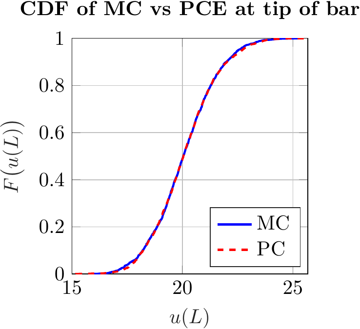
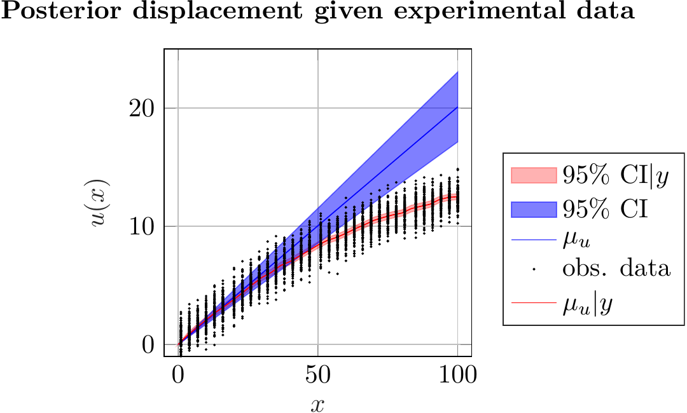
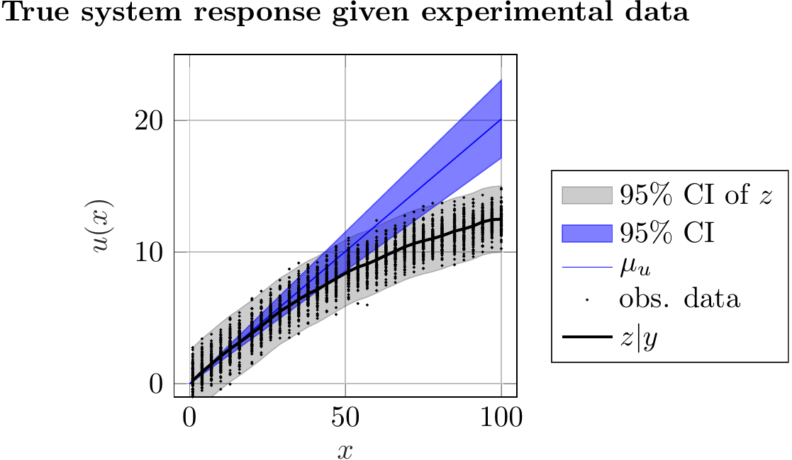

# StatFEM-Recon

[](LICENSE)

## 📄 Overview
`statFEM-Recon` is a MATLAB-based implementation of the **Statistical Finite Element Method (statFEM)** designed to address uncertainty quantification (UQ), data assimilation, and model updating for structural mechanics problems. This project focuses on two benchmark cases:

1. **One-Dimensional (1D) Tension Bar under Tip Load:**
- Simulates linear and nonlinear material behavior.
- Synthetic experimental data are generated to emulate real-world measurements.
- Uncertainty is incorporated through both Monte Carlo (MC) simulations and Polynomial Chaos Expansion (PCE).

2. **Two-Dimensional (2D) Infinite Plate with a Hole:**
- Models the plate using both Linear Elastic and St. Venant-Kirchhoff (nonlinear) material models.
- Synthetic observations are generated using the St. Venant-Kirchhoff model to test model selection and updating.


Key Contributions of statFEM-Recon:
- Deterministic FEM analysis.
- Monte Carlo and PCE-based uncertainty quantification.
- Hyperparameter estimation via maximum likelihood.
- Synthetic data generation with customizable noise and inherited mismatched model error.
- The prior displacement is updated in Bayesian formalisms in light of observation data.
- Visualization of simulation results.

## 📚 Related Publication
This codebase supports research from the following paper:  
> **Narouie, V., et al.** (2023). *Inferring displacement fields from sparse measurements using the statistical finite element method.*  
> Available on [j.ymssp.2023.110574](https://doi.org/10.1016/j.ymssp.2023.110574)

## 🚀 Features
- 🧮 Deterministic and probabilistic FEM simulations.
- 🎲 Monte Carlo simulations with customizable sample sizes.
- 📈 Polynomial Chaos Expansion for efficient uncertainty propagation.
- 📊 Hyperparameter identification via maximum likelihood estimation.
- 📉 Synthetic experimental data generation (linear & nonlinear cases).

---

## 🖥️ Installation
1. **Clone the repository:**
   ```bash
   git clone https://github.com/vhi3/statFEM-Recon.git
   cd statFEM-Recon
   ```

2. **Requirements:**
   - MATLAB R2020b or newer
   - Optimization Toolbox (for `fminunc`)
   - Statistics and Machine Learning Toolbox (for random number generation)

3. **Add library paths in MATLAB:**
   ```matlab
   addpath(genpath('lib'));
   ```

---

## 📝 Usage
1. **Run the main script for 1D:**
   ```matlab
   ./src/one_dimensional_tension_bar/main_1d
   ```
2. **Run the main script for 2D:**
   ```matlab
   ./src/two_dimensional_model_selection/main_2d
   ```
---

## 📊 Example Results
<p align="center">
  
  
  
  
</p>

---

## 📂 Repository Structure
```
statFEM-Recon/
├── lib/                             # Utility scripts and helper functions
│   ├── chol_solve.m                  # Cholesky solver
│   ├── CmdLineProgressBar.m          # Command-line progress bar utility
│   ├── Gauss_int.m                   # Gaussian integration utilities
│   ├── Hermite_PC.m                  # Hermite polynomial chaos functions
│   ├── importMesh.m                  # Mesh import functionality
│   ├── Jacobian1D.m                  # Jacobian computation for 1D analysis
│   ├── Jacobian2D.m                  # Jacobian computation for 2D analysis
│   ├── Lagrange2D_d.m                # Derivatives of 2D Lagrange shape functions
│   ├── lagrange_func.m               # Lagrange shape functions
│   ├── lagrange_func_d.m             # Derivatives of Lagrange functions
│   ├── logFunc2D.m                   # Log-likelihood function for 2D models
│   ├── logposterior2D.m              # Log-posterior computation for 2D models
│   ├── makeSurf.m                    # Surface generation for plotting
│   ├── multi_index.m                 # Multi-index generation for PCE
│   ├── sqexp.m                       # Squared exponential covariance function
│   ├── sqexp_deriv.m                 # Derivatives of the squared exponential function
│   └── viridis.m                     # Colormap generation utility
│
├── src/                             # Source codes for simulations and analyses
│   ├── one_dimensional_tension_bar/ # 1D tension bar problem implementation
│   │   ├── FEM_Bar_deter_Tipload.m       # Deterministic FEM for tip load
│   │   ├── main_1d.m                     # Main driver script for 1D analysis
│   │   ├── tensionBar_1D_FEM_processLE.m # FEM linear elasticity solver
│   │   ├── tensionBar_1D_FEM_processLE_MC.m # Monte Carlo simulation for 1D
│   │   ├── tensionBar_1D_FEM_processLE_PC.m # PCE analysis for 1D
│   │   ├── tensionBar_1D_hyperParameter_LE.m # Hyperparameter estimation
│   │   ├── tensionBar_1D_obs_generate.m  # Synthetic observation generation
│   │   ├── tensionBar_1D_plot.m          # General plotting routines
│   │   ├── tensionBar_1D_plot_pdf.m      # PDF plotting for results
│   │   ├── tensionBar_1D_P_matrix.m      # Projection matrix calculation
│   │   ├── tensionBar_1D_preprocess.m    # Preprocessing for 1D problems
│   │   └── tensionBar_1D_statFEM_processLE.m # statFEM analysis for 1D
│   │
│   └── two_dimensional_model_selection/ # 2D infinite plate beam problem
│       ├── globalstiffness_linearElastic2D.m # Stiffness matrix for linear elasticity
│       ├── globalstiffness_stKirchhoff2D.m  # Stiffness matrix for St. Venant model
│       ├── infinitePlate_balancedStatus_LE.m # Equilibrium check (LE)
│       ├── infinitePlate_balancedStatus_ST.m # Equilibrium check (ST)
│       ├── infinitePlate_BayesFactor.m      # Bayes factor calculation
│       ├── infinitePlate_FEM_postprocessLE.m # Postprocessing (LE)
│       ├── infinitePlate_FEM_postprocessST.m # Postprocessing (ST)
│       ├── infinitePlate_FEM_preprocess.m   # Preprocessing for 2D
│       ├── infinitePlate_FEM_processLE.m    # Linear elasticity solver (2D)
│       ├── infinitePlate_FEM_processLE_monteCarlo.m # Monte Carlo simulation (2D)
│       ├── infinitePlate_FEM_processLE_NIPC.m # PCE analysis (LE)
│       ├── infinitePlate_FEM_processST.m    # St. Venant Kirchhoff solver
│       ├── infinitePlate_FEM_processST_monteCarlo.m # Monte Carlo simulation (ST)
│       ├── infinitePlate_FEM_processST_NIPC.m # PCE analysis (ST)
│       ├── infinitePlate_FEM_surfplot.m     # Plotting surface results
│       ├── infinite_plate.geo               # Gmsh geometry file
│       ├── infinitePlate_hyperParameter_LE.m # Hyperparameter estimation (LE)
│       ├── infinitePlate_hyperParameter_ST.m # Hyperparameter estimation (ST)
│       ├── infinitePlate_obs_generate.m     # Generate synthetic observation data
│       ├── infinitePlate_P_matrix.m         # Projection matrix
│       ├── infinitePlate_RMSE.m             # RMSE calculation
│       ├── infinitePlate_statFEMbalancedStatus_ST.m # Balanced status for statFEM
│       ├── infinitePlate_statFEM_postprocessLE.m # statFEM postprocessing (LE)
│       ├── infinitePlate_statFEM_postprocessST.m # statFEM postprocessing (ST)
│       ├── infinitePlate_statFEM_processLE.m  # statFEM processing (LE)
│       ├── infinitePlate_statFEM_processST.m  # statFEM processing (ST)
│       ├── main_2d.m                        # Main driver script for 2D analysis
│       ├── Mesh_infPlate.m                  # Mesh generation script for 2D
│       ├── sensorLocation.mat               # Sensor location data
│       └── voigt.m                          # Voigt notation conversion
│
└── README.md                          # Project overview and instructions

```

---

## 🛡️ License
This project is licensed under the [GNU General Public License v3.0 (GPL-3.0)](LICENSE).  
Feel free to use, modify, and distribute under the terms of the GPL.

---

## 🙌 Acknowledgments
- Developed at **TU-Braunschweig**.
- Special thanks to the research team and community contributors.

---

🚀 **Enjoy using `statFEM-Recon` for your uncertainty quantification needs!**

